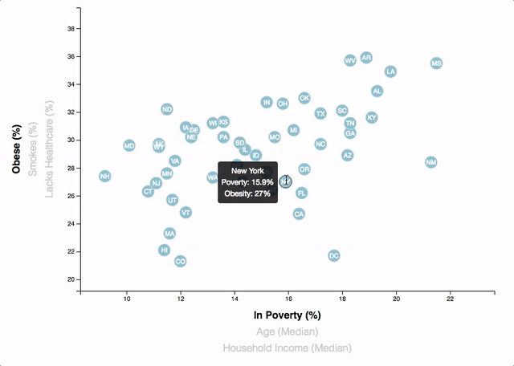

# Data Journalism and D3

This project utilizes D3 and data from the U.S. Census Bureau and the Behavioral Risk Factor Surveillance System to build a dynamic graph. 

### Dynamic Graph

This graph displays correlations between different demographcs and risks factors. This scatter plot has multiple labels on each axis, allowing the user to select what data to display. Transitions for the data points and axes ranges are animated. 

#### d3-tip

tooltips was used to add in additional information for each data point. As the user hovers their cursor over each circle, a tooltip appears with the data that the user has selected.

